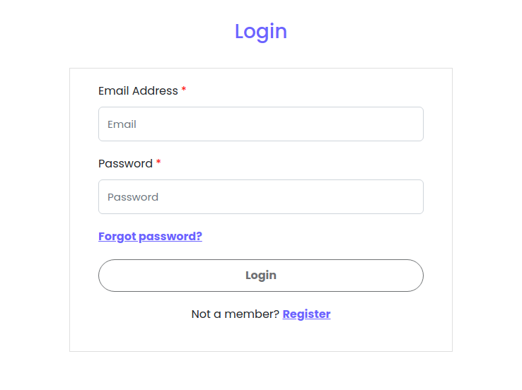
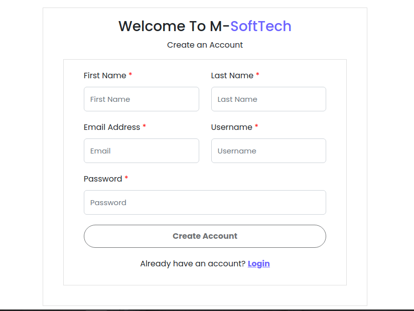
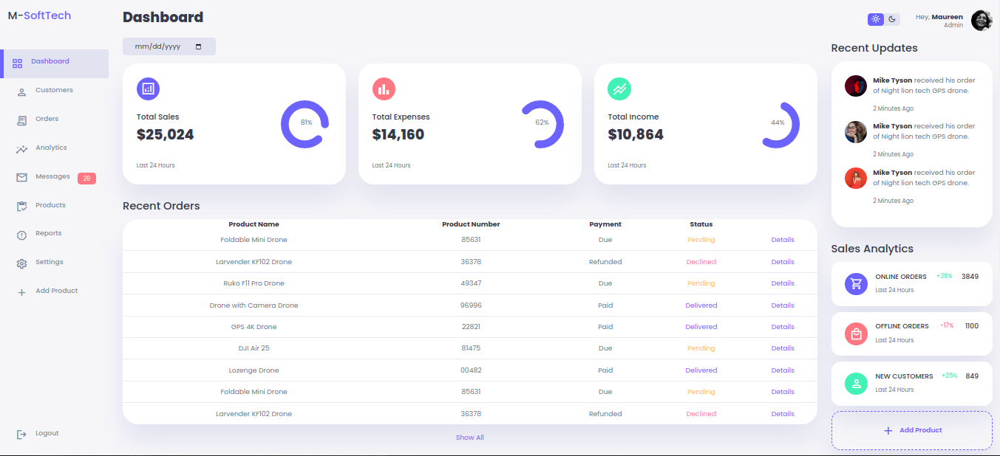
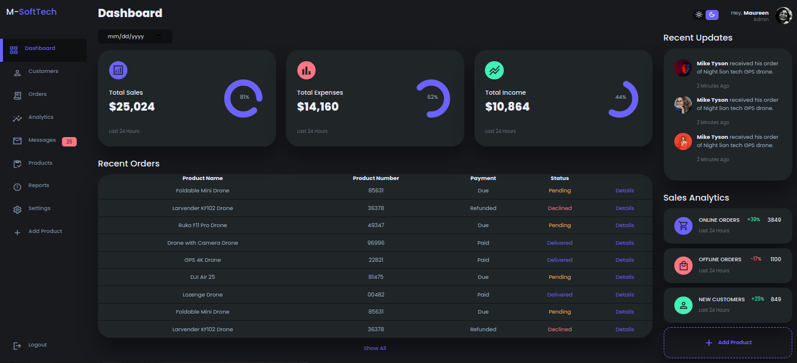
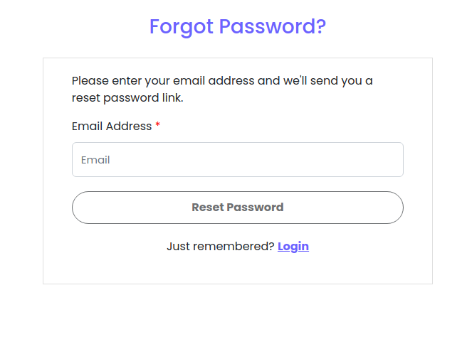

# Simple Task 1
## By Maureen Njihia on 19th June 2023
# Description
Task 1 by Three Modern K Systems that allows users to view:
* Login Page
* Dashboard Page
* Registration Page
* Reset Password Page

# Technologies Used
* HTML5
* CSS3
* JavaScript
* Boostrap 5.2

# Live Link
* https://simple-task1.vercel.app/

# Some Screenshots
* Login Page

 

* Registration Page

 

* Dashbard Page Light

 

* Dashbard Page Dark

 

* Reset Password Page 

 

# Known Bugs
There are no known bugs of this task at the moment 😎.
# Support and contact details
For any contributions towards this project:
* Email: maureennjihia468@gmail.com
* Phone: 0704592362
# License
Copyright (c) 2023 Maureen Njihia

Permission is hereby granted, free of charge, to any person obtaining
a copy of this software and associated documentation files (the
"Software"), to deal in the Software without restriction, including
without limitation the rights to use, copy, modify, merge, publish,
distribute, sublicense, and/or sell copies of the Software, and to
permit persons to whom the Software is furnished to do so, subject to
the following conditions:

The above copyright notice and this permission notice shall be
included in all copies or substantial portions of the Software.

THE SOFTWARE IS PROVIDED "AS IS", WITHOUT WARRANTY OF ANY KIND,
EXPRESS OR IMPLIED, INCLUDING BUT NOT LIMITED TO THE WARRANTIES OF
MERCHANTABILITY, FITNESS FOR A PARTICULAR PURPOSE AND
NONINFRINGEMENT. IN NO EVENT SHALL THE AUTHORS OR COPYRIGHT HOLDERS BE
LIABLE FOR ANY CLAIM, DAMAGES OR OTHER LIABILITY, WHETHER IN AN ACTION
OF CONTRACT, TORT OR OTHERWISE, ARISING FROM, OUT OF OR IN CONNECTION
WITH THE SOFTWARE OR THE USE OR OTHER DEALINGS IN THE SOFTWARE.